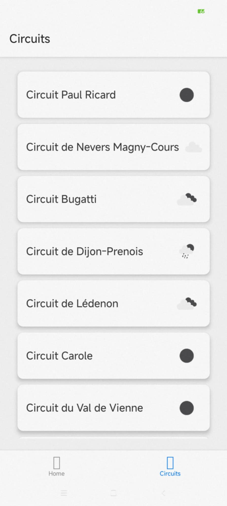
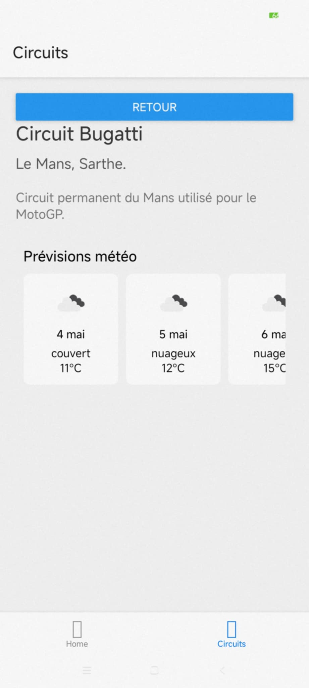

# LapLink - Application Mobile de Circuits Automobiles
> **Note:** Il s'agit d'un projet fictif réalisé dans le cadre de ma formation.
## Description du projet
LapLink est une application mobile permettant aux pilotes amateurs d'enregistrer leurs meilleurs temps sur circuits. L'application offre la possibilité d'enregistrer des voitures par pilotes, d'acceder aux circuits proches d'eux, de comparer leurs résultats à d'autres pilotes et de participer à des courses.

Cette branche a pour objectif de répertorier les circuits automobiles français et d'afficher la météo en temps réel ainsi que les prévisions météorologiques pour chacun de ces circuits.

## Technologies Utilisées
* React Native
* JavaScript
* React Navigation
* React Native bootsplash
* Docker et Docker Compose
* PostgreSQL avec extension PostGIS
* Node.js (pour l'API backend)

## Fonctionnalités Principales
* Liste des circuits automobiles français
* Affichage détaillé de chaque circuit (longueur, localisation, caractéristiques)
* Météo en temps réel sur le circuit sélectionné
* Prévisions météorologiques pour les prochains jours

## APIs Utilisées
* OpenWeather API
  OpenWeather fournit des données météorologiques précises en temps réel ainsi que des prévisions pour n'importe quelle localisation. Dans notre application, nous utilisons ces données pour afficher les conditions météorologiques actuelles et futures sur les circuits.
* API LapLink (backend personnalisé)
  API dédiée pour la communication entre l'application et sa base de données, permettant de récupérer les informations sur les circuits automobiles français. L'API est exposée sur le port 3000 et communique avec une base de données PostgreSQL/PostGIS.

## Instructions d'installation et de lancement

### Prérequis :
* `yarn`
* `nodejs`
* `android studio` (pour Android) ou un `smartphone android`
* `docker` et `docker-compose`

### Installation

1. Clonez le dépôt:
```
git clone [URL_DU_REPO]
cd laplink
git checkout Audrey/bottomNav_racingCircuits
```

2. Installez les dépendances:
```
yarn 
```

### Configuration de l'environnement

1. Créez un fichier `.env` à la racine du projet avec les variables suivantes:
```
# API OpenWeather
OPENWEATHER_API_KEY=votre_clé_api_openweather ou 575d5db056d98746a9da34b3fbce8aa0

# Configuration de la base de données PostgreSQL
POSTGRES_USER=reactnativeapp
POSTGRES_PASSWORD=password
POSTGRES_DB=reactnativeapp_db

# URL de connexion à la base de données
DATABASE_URL=postgresql://reactnativeapp:password@db:5432/reactnativeapp_db
```

### Démarrage de l'environnement Docker

1. Lancez les conteneurs Docker:
```
docker-compose up -d
```

Cela va démarrer:
- Un conteneur PostgreSQL/PostGIS sur le port 5432
- Un conteneur pour l'API sur le port 3000

2. Vérifiez que les conteneurs sont bien démarrés:
```
docker-compose ps
```

### Lancement de l'application mobile

Pour Android:
```
yarn android
```

## Captures d'écran ou démonstration
Si l'installation a bien fonctionné, voici ce que vous devriez voir :
### Liste des circuits

*Affichage de la liste des circuits automobiles français avec conditions météo actuelles*

### Détail d'un circuit

*Affichage détaillé du Circuit Bugatti avec prévisions météorologiques sur 5 jours*